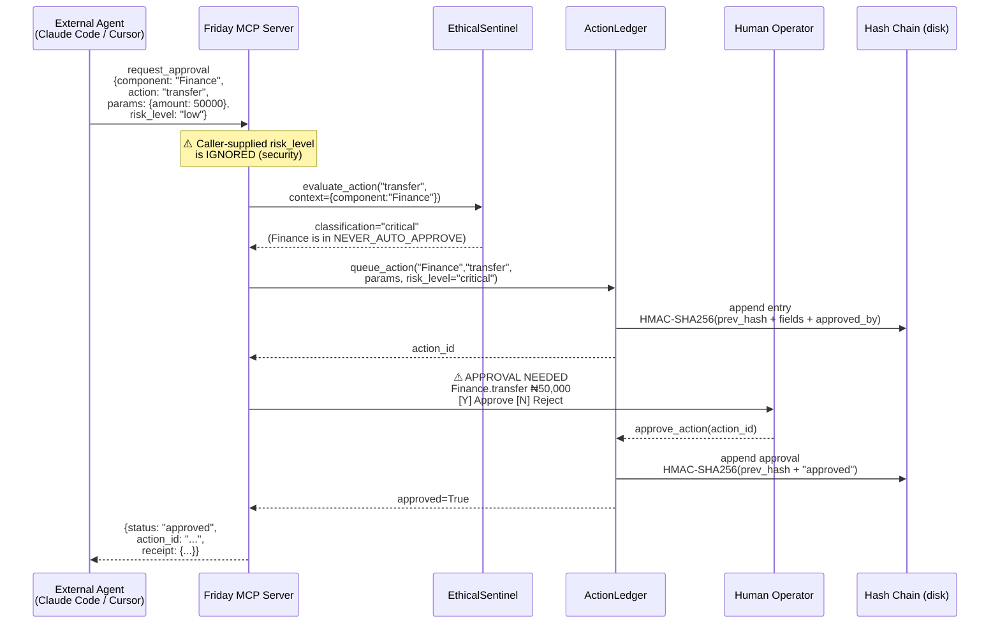
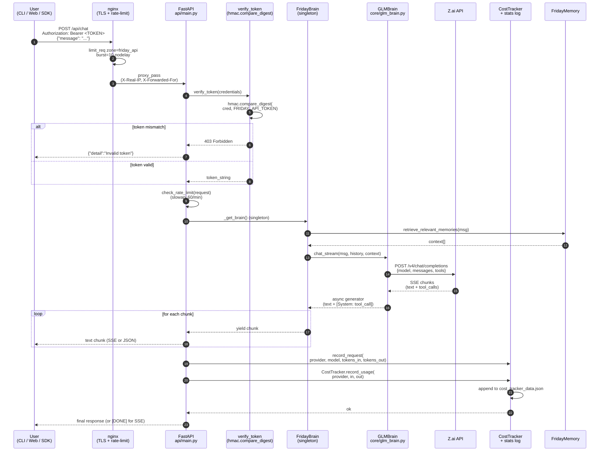
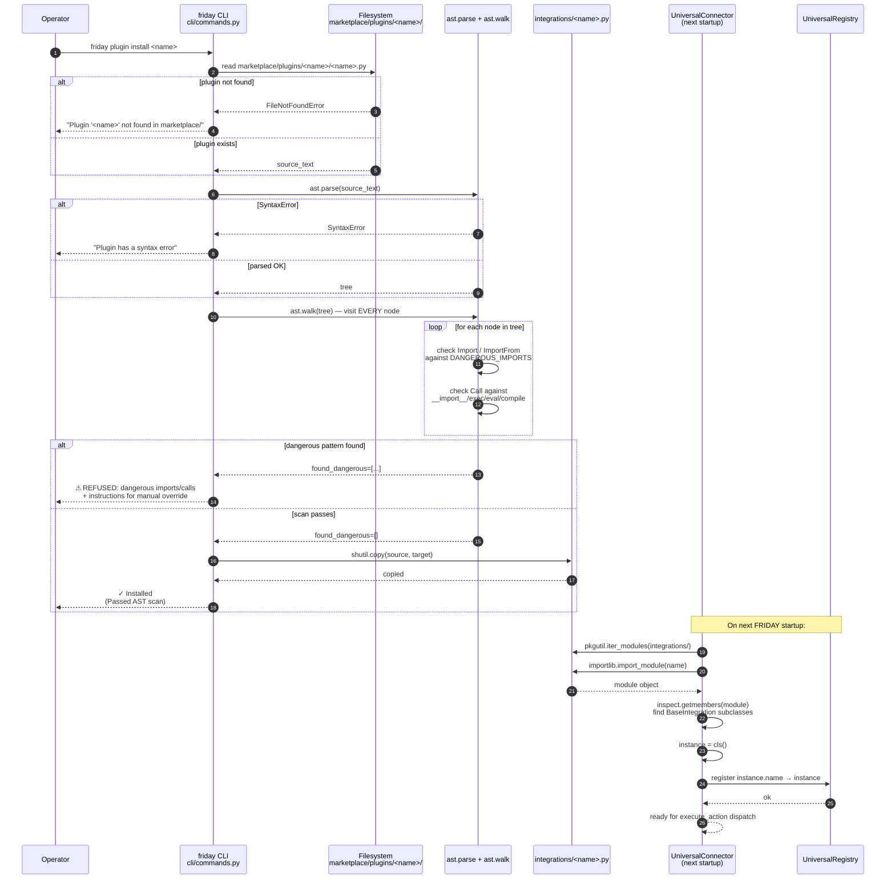

# FRIDAY v3.2 — Architecture

## System Architecture Diagram

```mermaid
graph TB
    subgraph "Client Layer"
        CLI[CLI TUI<br/>cli/terminal.py]
        VSCode[VS Code Extension<br/>apps/vscode/]
        Web[Web Dashboard<br/>apps/web/]
        Desktop[Desktop App<br/>apps/desktop/]
        BrowserExt[Browser Extension<br/>apps/browser_extension/]
        Mobile[Mobile App<br/>apps/mobile/]
        MCPClient[External MCP Clients<br/>Claude Code, Cursor]
    end

    subgraph "API Layer"
        FastAPI[FastAPI Server<br/>api/main.py]
        ChatRoute[Chat Route<br/>api/routes/chat.py]
        ActionsRoute[Actions Route<br/>api/routes/actions.py]
        HealthRoute[Health Route<br/>api/routes/health.py]
        MemoryRoute[Memory Route<br/>api/routes/memory.py]
        AgentRoute[Agents Route<br/>api/routes/agents.py]
        WebhookRoute[Webhooks Route<br/>api/routes/webhooks.py]
        OtherRoutes[20+ Other Routes<br/>stats, trust, goals, etc.]
    end

    subgraph "MCP Layer"
        MCPServer[MCP Server<br/>mcp_server.py<br/>8 tools over JSON-RPC/stdio]
        ReqApproval[request_approval<br/>★ Killer Feature]
        ExecAction[execute_action]
        Chat[chat]
        Vision[vision]
        WebSearch[web_search]
        ImageGen[image_generation]
        VideoGen[video_generation]
        CodeExec[code_execution]
    end

    subgraph "Core AI Layer"
        Brain[FridayBrain<br/>core/brain.py<br/>1168 LOC god class]
        GLMBrain[GLMBrain<br/>core/glm_brain.py]
        ClaudeBrain[Claude via Anthropic SDK]
        GeminiBrain[GeminiBrain<br/>core/gemini_brain.py]
        LocalBrain[LocalBrain<br/>core/local_brain.py<br/>Ollama]
        Council[Council Mode<br/>core/council_mode.py<br/>Parallel multi-provider]
        Sentinel[EthicalSentinel<br/>core/sentinel.py<br/>Risk classification]
        Ledger[ActionLedger<br/>core/ledger.py<br/>HMAC-SHA256 hash chain]
        Memory[FridayMemory<br/>core/memory.py]
        MultiModal[MultiModalMemory<br/>core/multimodal_memory.py]
        Subconscious[SubconsciousMind<br/>database/subconscious.py]
        Embeddings[ZaiEmbedder<br/>core/embeddings.py]
        CostTracker[CostTracker<br/>core/cost_tracker.py]
    end

    subgraph "Agent Layer"
        AgentMgr[AgentManager<br/>agents/agent_manager.py]
        Research[ResearchAgent]
        Coding[CodingAgent]
        Writing[WritingAgent]
        Task[TaskAgent]
        Tactical[TacticalManager]
        CodingOrch[CodingOrchestrator]
    end

    subgraph "Integration Layer"
        Connector[UniversalConnector<br/>core/universal_connector.py<br/>Ledger-gated dispatch]
        Registry[UniversalRegistry<br/>integrations/registry.py]
        BaseInt[BaseIntegration<br/>integrations/base.py]
        Weather[Weather]
        Finance[Finance]
        Commerce[Commerce]
        Printer[Printer]
        Printer3D[Printer3D]
        SmartHome[SmartHome]
        Spotify[Spotify]
        Calendar[Calendar]
        Gmail[Gmail]
        ImageGenInt[ImageGen<br/>CogView-3]
        VideoGenInt[VideoGen<br/>CogVideoX]
        Nigerian[NigerianContext]
        OtherInt[11 other integrations]
    end

    subgraph "Desktop Automation"
        PCControl[PCControl<br/>control/pc_control.py<br/>pyautogui]
        BrowserControl[BrowserControl<br/>control/browser_control.py<br/>Playwright]
        FileManager[FileManager<br/>control/file_manager.py<br/>commonpath protection]
        AppLauncher[AppLauncher<br/>control/app_launcher.py]
    end

    subgraph "Voice & Vision"
        Voice[Voice Stack<br/>voice/<br/>Whisper + ElevenLabs + Porcupine]
        VisionMod[Vision Stack<br/>vision/<br/>GLM-4V + mss + pytesseract]
    end

    subgraph "Persistence"
        Supabase[Supabase<br/>database/supabase_client.py]
        VectorStore[VectorStore<br/>database/vector_store.py<br/>pgvector]
        ChainFile[chain.json<br/>HMAC-SHA256 audit log]
        PendingFile[pending.json<br/>Pending actions]
        CostFile[cost_data.json<br/>Token usage]
    end

    subgraph "External Services"
        ZaiAPI[Z.ai API<br/>GLM-4-Flash, CogView-3,<br/>CogVideoX, Embedding-3]
        AnthropicAPI[Anthropic API<br/>Claude]
        GoogleAPI[Google APIs<br/>Calendar, Gmail]
        SpotifyAPI[Spotify API]
        OpenWeather[OpenWeatherMap]
        CoinGecko[CoinGecko]
        OctoPrint[OctoPrint/Moonraker]
        HomeAssistant[Home Assistant]
        Telegram[Telegram Bot API]
        Stripe[Stripe Sandbox]
    end

    %% Client connections
    CLI --> FastAPI
    VSCode --> FastAPI
    Web --> FastAPI
    Desktop --> FastAPI
    BrowserExt --> FastAPI
    Mobile --> FastAPI
    MCPClient -->|JSON-RPC/stdio| MCPServer

    %% API routing
    FastAPI --> ChatRoute
    FastAPI --> ActionsRoute
    FastAPI --> HealthRoute
    FastAPI --> MemoryRoute
    FastAPI --> AgentRoute
    FastAPI --> WebhookRoute
    FastAPI --> OtherRoutes

    %% MCP tools
    MCPServer --> ReqApproval
    MCPServer --> ExecAction
    MCPServer --> Chat
    MCPServer --> Vision
    MCPServer --> WebSearch
    MCPServer --> ImageGen
    MCPServer --> VideoGen
    MCPServer --> CodeExec

    %% Core routing
    ChatRoute --> Brain
    ChatRoute --> CostTracker
    ReqApproval --> Ledger
    ReqApproval --> Sentinel
    ExecAction --> Connector
    ActionsRoute --> Ledger

    Brain --> GLMBrain
    Brain --> ClaudeBrain
    Brain --> GeminiBrain
    Brain --> LocalBrain
    Brain --> Council
    Brain --> Memory
    Brain --> Subconscious
    Brain --> CostTracker

    GLMBrain -->|free tier| ZaiAPI
    ClaudeBrain --> AnthropicAPI
    GeminiBrain --> GoogleAPI

    %% Agent routing
    AgentRoute --> AgentMgr
    AgentMgr --> Research
    AgentMgr --> Coding
    AgentMgr --> Writing
    AgentMgr --> Task
    AgentMgr --> Tactical
    AgentMgr --> CodingOrch
    Research --> Brain
    Coding --> Brain

    %% Integration routing
    Connector --> Ledger
    Connector --> Sentinel
    Connector --> Registry
    Registry --> BaseInt
    BaseInt --> Weather
    BaseInt --> Finance
    BaseInt --> Commerce
    BaseInt --> Printer
    BaseInt --> Printer3D
    BaseInt --> SmartHome
    BaseInt --> Spotify
    BaseInt --> Calendar
    BaseInt --> Gmail
    BaseInt --> ImageGenInt
    BaseInt --> VideoGenInt
    BaseInt --> Nigerian
    BaseInt --> OtherInt

    %% External API calls
    Weather --> OpenWeather
    Finance --> CoinGecko
    Commerce --> Stripe
    Printer3D --> OctoPrint
    SmartHome --> HomeAssistant
    Spotify --> SpotifyAPI
    Calendar --> GoogleAPI
    Gmail --> GoogleAPI
    ImageGenInt --> ZaiAPI
    VideoGenInt --> ZaiAPI

    %% Desktop automation
    PCControl --> Ledger
    BrowserControl --> Ledger
    FileManager --> Ledger

    %% Voice/Vision
    Voice --> Brain
    VisionMod --> GLMBrain

    %% Persistence
    Memory --> VectorStore
    Memory --> Supabase
    MultiModal --> Embeddings
    VectorStore --> Supabase
    Ledger --> ChainFile
    Ledger --> PendingFile
    CostTracker --> CostFile

    %% Styling
    classDef killer fill:#ff6b6b,stroke:#c92a2a,stroke-width:3px,color:#fff
    classDef god fill:#ffd43b,stroke:#f59f00,stroke-width:2px
    classDef secure fill:#51cf66,stroke:#2f9e44,stroke-width:2px
    classDef external fill:#a5d8ff,stroke:#1971c2,stroke-width:1px

    class ReqApproval killer
    class Brain god
    class Ledger,FileManager secure
    class ZaiAPI,AnthropicAPI,GoogleAPI,SpotifyAPI,OpenWeather,CoinGecko,OctoPrint,HomeAssistant,Telegram,Stripe external
```



## Threat Model

```mermaid
graph LR
    subgraph "Attack Surface"
        A1[MCP stdio<br/>No auth]
        A2[Plugin marketplace<br/>AST scan bypassable]
        A3[/api/health/deep<br/>Unauthenticated]
        A4[Webhook endpoints<br/>GitHub fails open]
        A5[Desktop automation<br/>POWER auto-approves type_text]
        A6[Forgeable approved_by<br/>FIXED in v3.2]
    end

    subgraph "Defenses"
        D1[HMAC-SHA256 audit chain<br/>with server secret]
        D2[EthicalSentinel<br/>wired into dispatch]
        D3[Full-AST plugin scan<br/>catches lazy imports]
        D4[Caller-supplied risk_level<br/>IGNORED]
        D5[8 MCP tools advertised<br/>in tools/list]
        D6[commonpath traversal<br/>protection]
        D7[NEVER_AUTO_APPROVE<br/>component allowlist]
    end

    A1 -.->|mitigated by| D4
    A2 -.->|mitigated by| D3
    A6 -.->|fixed by| D1
    A5 -.->|partially mitigated| D7
```

## Data Flow: MCP `request_approval` (the killer feature)



## Data Flow Diagrams

The following diagrams trace the three most important request paths through
FRIDAY. Each is annotated with the security controls that fire at each step.

### A. Chat request flow (user → API → brain → GLM → response)



**Security controls fired**
1. nginx rate limit (per-IP, 30r/m with burst 10)
2. TLS termination + security headers
3. Bearer token comparison (timing-safe)
4. slowapi per-route rate limit (60/min for `/api/chat`)
5. Memory context retrieval (no authz on memory yet — single-user)
6. GLM call uses server-side API key (never exposed to client)
7. Cost tracking records every request (audit trail)

---

### B. Plugin install flow (marketplace → AST scan → integrations/)



**Security controls fired**
1. Static AST scan walks the **entire** tree (v3.2 fix — prior versions only visited top-level nodes)
2. Blocked imports: `os`, `subprocess`, `socket`, `shlex`, `ctypes`, `sys`, `importlib`, `builtins`, `pty`, `multiprocessing`
3. Blocked calls: `__import__`, `exec`, `eval`, `compile`
4. On refusal: clear error message + manual override instructions (operator must consciously bypass)
5. At runtime: every `execute()` call still goes through `UniversalConnector` → `EthicalSentinel` → `ActionLedger` gate
6. `NEVER_AUTO_APPROVE_COMPONENTS` blocks auto-approval of high-risk components regardless of profile

**Residual risk** (see [Threat Model T1](./THREAT_MODEL.md#t1-malicious-plugin-supply-chain-attack-critical))
- Computed attribute access (`getattr(obj, "sub"+"process")`) bypasses the scan
- Transitive imports (`import requests` → `requests` imports `socket`) are not blocked
- No sandbox — plugins run in-process with full privileges
- Manual override (`cp`) bypasses the scan entirely

---

### C. Deployment topology (Docker → nginx → FastAPI → GLM API)

```mermaid
graph TB
    subgraph "Host (Ubuntu VPS)"
        subgraph "Docker / systemd"
            Nginx[nginx:443<br/>TLS + rate-limit]
            Friday[FRIDAY uvicorn<br/>127.0.0.1:8000<br/>user=friday]
            DB[(Supabase Postgres<br/>127.0.0.1:5432)]
        end

        subgraph "Filesystem (/opt/friday)"
            Env[.env<br/>chmod 600]
            Chain[action_ledger_chain.json]
            Pending[action_ledger_pending.json]
            Cost[cost_tracker_data.json]
            Secret[~/.friday/ledger_secret<br/>chmod 600]
            Log[friday.log]
        end
    end

    subgraph "External"
        User[User browser<br/>https://friday.example.com]
        MCP[MCP client<br/>Claude Code, Cursor]
        Zai[Z.ai API<br/>open.bigmodel.cn]
        GH[GitHub webhooks]
        Stripe[Stripe webhooks]
    end

    User -->|HTTPS + Bearer token| Nginx
    MCP -.stdio.-> Friday
    GH -->|POST /api/webhooks/github<br/>HMAC-SHA256| Nginx
    Stripe -->|POST /api/webhooks/stripe<br/>signature (stub)| Nginx

    Nginx -->|proxy_pass 127.0.0.1:8000| Friday
    Friday -->|SELECT / INSERT| DB
    Friday -->|HTTPS POST /v4/chat/completions| Zai
    Friday -->|append| Chain
    Friday -->|append| Pending
    Friday -->|append| Cost
    Friday -->|read/write| Env
    Friday -->|read HMAC secret| Secret
    Friday -->|append| Log

    classDef secure fill:#51cf66,stroke:#2f9e44,color:#000
    classDef neutral fill:#a5d8ff,stroke:#1971c2,color:#000
    classDef external fill:#ffd43b,stroke:#f59f00,color:#000
    class Chain,Pending,Secret,Env secure
    class Nginx,Friday,DB neutral
    class User,MCP,Zai,GH,Stripe external
```

**Security boundaries**
- **Public → nginx:** only ports 80/443 exposed; 8000 (uvicorn) and 5432 (Postgres) bound to 127.0.0.1
- **nginx → uvicorn:** proxy_pass on localhost; `X-Forwarded-For` chain preserved
- **uvicorn → Z.ai:** outbound HTTPS only; API key in env, never logged
- **uvicorn → filesystem:** runs as `friday` user with `ProtectSystem=strict`, `ReadWritePaths=/opt/friday/data`
- **uvicorn → Postgres:** localhost only; credentials from env (not hardcoded in v3.2 — see [Deployment Guide §4.3](./DEPLOYMENT_GUIDE.md#step-2--create-friday-user--directory) for the docker-compose caveat)
- **HMAC secret:** stored at `~/.friday/ledger_secret` with `chmod 600`; never written to logs

**Resource limits (recommended)**
- `MemoryMax=2G` (FridayBrain + integrations)
- `CPUQuota=200%` (2 cores)
- `LimitNOFILE=65536` (WebSocket connections + file handles)
- nginx `client_max_body_size 10m` (visual-memory uploads)
